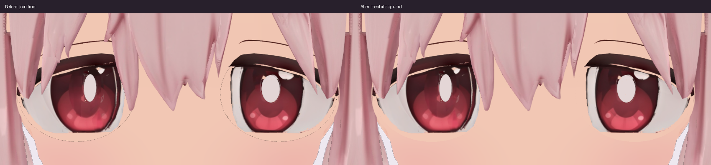
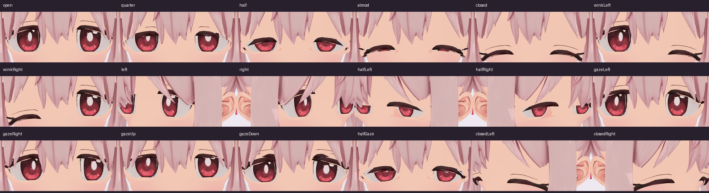

# 目と肌の接合線だけを取り除く修正

2026-09-30。
白目の外に出ていた点線を、目の描画内の肌色サンプリング判定だけで取り除きました。
実行時の変更は `src/eye-surface.ts` の条件1か所とコメントです。
元の瞳の画像・UV・形状・骨・まばたき、他の材質は変更していません。

## 原因と局所修正

輪郭の描画を止めたり、眼球・肌パーツの深度を変えても線は残りました。
肌画像 `Eye_Soft_Blush` の眼孔には黒い未描画部分があり、境界のフィルタリングで黒と肌が混ざっていました。
旧判定のRGB合計 `< 0.12` は完全に黒い画素しか除けず、半端に混ざった画素を肌色として使っていました。

このモデルの有効な肌画像の赤成分は約0.97（線形色）です。
`lid.r < 0.90` のときだけ、すでに使っていた同じ高さの有効な肌色へ置き換えます。
この処理は既存の「肌の領域」判定の内側だけに適用されます。
白目・虹彩・瞳孔・反射を読み取る画像や座標、まつげの形状・表示、陰影やアウトライン設定はそのままです。
新しいテクスチャや形状補正は追加していません。

## 確認結果

同じカメラ・照明で実モデルを描画し、比較時だけ髪を固定しました。
表情と視線は検査用の入力で、本人のWebカメラによる確認ではありません。

- 開眼・途中のまばたき・閉眼・左右ウィンク・左右斜め・上下左右の視線など18状態を比較しました。
- 正面の開眼1000×700では、差分は目の肌境界の1272画素だけでした。目の周囲以外の差分は0画素です。
- 正面開眼で検査した虹彩・まつげの赤系サンプル29618画素と、白目・反射の中性色サンプル22626画素は変化していません。
  他の状態では、色によるサンプル分類に含まれた肌や端のぼかし6画素に1～2階調の差があります。分類を意味上の瞳領域全体と同一視しません。
- 正面・左右斜めの閉眼は、修正前後で全画素差0でした。
- 顔全体の差分350画素も目の周囲だけでした。
- 自動テスト22件、型検査、配信ビルドが成功し、ローカルの実GPU描画にシェーダー・実行時エラーはありませんでした。

詳細は[描画差分記録](images/eye-seam-20260930/render-analysis.json)に保存しています。
VRM原本と参照画像のSHA-256は前回から変わっていません。
元の3D制作ファイルも変更していません。
前回に記録した公開アプリの読み込み中の髪の初期化エラーは、この修正の範囲に含めません。
