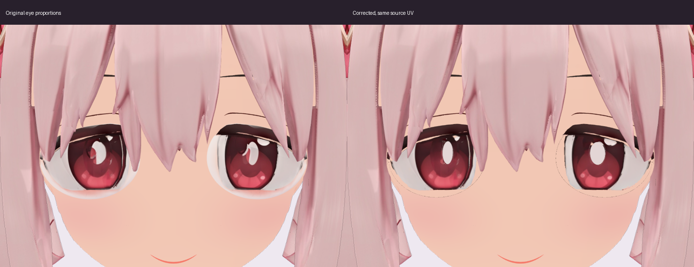
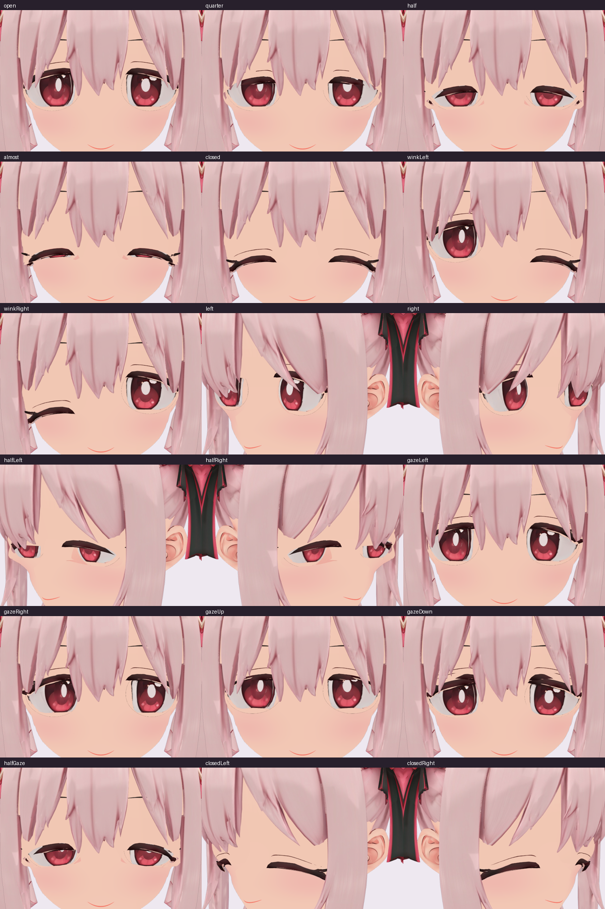
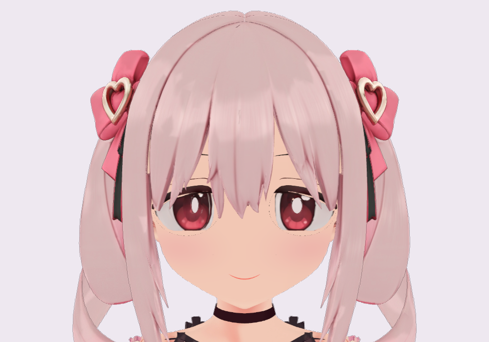

# 元の目のサイズとデザインを保つ修正

2026-09-30。
元の顔の3Dモデルの画像とUV座標へ戻し、白目・虹彩・瞳孔の形、大きさ、位置を保持します。
中央の崩れた白い反射と、白目の外に混入した肌の部分だけを補正します。

## 参照と寸法

正面イラスト `head/front.png` と、Tripoの `anime+head+3d+model.fbx` に由来する `SOURCE_HEAD` の正投影を参照しました。
採用した画像は `public/eyes/source-eye-projection.png`（4096×4096）です。
原本を保存し直さず、作業メモリ上で中央の白い反射に重なっていた小面2枚だけを除いて投影しました。
白目や虹彩の輪郭、眼球の形は変えていません。

`Eye_Left` と `Eye_Right` は、それぞれ760頂点の既存の眼球メッシュです。
両眼の元のUV座標が正投影画像へ等倍で対応することを確認しました。
画像の拡大縮小や座標の移動を加えず、そのUVで元の白目・虹彩・瞳孔を読み取ります。
眼球の形状・UV・骨への接続と、独立したまぶた・まつげは維持します。

測定したLeft側の元の虹彩幅は0.087890625（SOURCE_HEADの座標）、正投影では327.27画素です。
以前の手続き描画では幅0.11592となり、約32%大きくなっていました。
中心Xも0.128174から0.143へ移っていたため、その描画方式を廃止しました。
現在の虹彩と瞳孔には、新しく推測した楕円や中心座標を使いません。

## 局所補正

中央の白い反射は、元画像の主要な白い成分を測って範囲を固定します。
Left側は93×141画素、Right側は63×142画素で、モデルの左右と画面の左右は逆です。
補正する白い形のぼかしは、この測定範囲の内側へ入れます。
反射周辺の明るい破片だけを近くの元の虹彩色へなじませ、ピンクの模様と瞳孔を残します。

白目の外の暖色の肌には、既存の `Eye_Soft_Blush` の肌画像を使います。
元のMToon材質を維持し、まぶたと同じ顔用の照明・陰影設定を使います。
既存の深度判定で、まぶたとまつげが眼球を隠します。

この補正は `Avatar.load()` から適用され、アプリの表示・合成・出力・録画が同じアバター描画を使います。
VRM原本、配信用に分離した元モデル、Blender原本は書き換えていません。
他のVRMビューアーには、このアプリ専用の補正は適用されません。

## 検証と残る制約

実ブラウザの実モデルで、同じカメラと照明を使って画像を確認しました。
表情値と視線は制御した検査入力で、本人のWebカメラによる確認とは区別します。

- 開眼、まばたき25%・50%・80%・100%、左右のウィンク。
- 左右斜め向きの開眼・半眼・閉眼、上下左右の視線、半眼と視線の組み合わせ。合計18状態。
- 正面と左右斜めの閉眼で、眼球を非表示にしても画像が変わらないこと。比較時だけ髪を固定し、3方向とも全画素差がゼロ。
- 眼球の形状・UV・骨の接続・独立したまぶたの材質の保持を含む自動テスト22件と、型検査・配信ビルドの成功。
- 修正後の実描画でシェーダーや実行時エラーがないこと。

[描画検査記録](images/eye-reference-20260930/render-analysis.json)に、参照画像のハッシュ、元の虹彩幅、等倍UV、反射の測定範囲、閉眼比較を保存しています。
VRM原本のSHA-256は `5167e2f97b107dfdc8dda2b7e9add24a9392c506f39be0411a6c1a3e7fa5aab0` です。

拡大すると目と肌の接合部に細い線が残っています。
今回の補正は目のサイズ・配置・元の模様の保持を確認したもので、接合部の形状をすべて作り直したものではありません。
本人のWebカメラ入力、他の端末・GPU、長時間録画は今回の確認範囲に含めません。
旧 `images/eye-design-20260930/` の画像と検査記録は、以前の拡大された手続き描画の記録です。
今回の採用結果とは区別してください。

