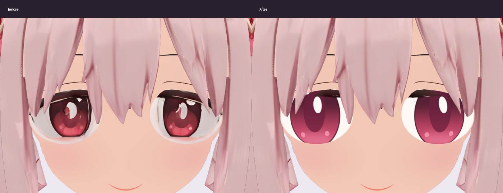
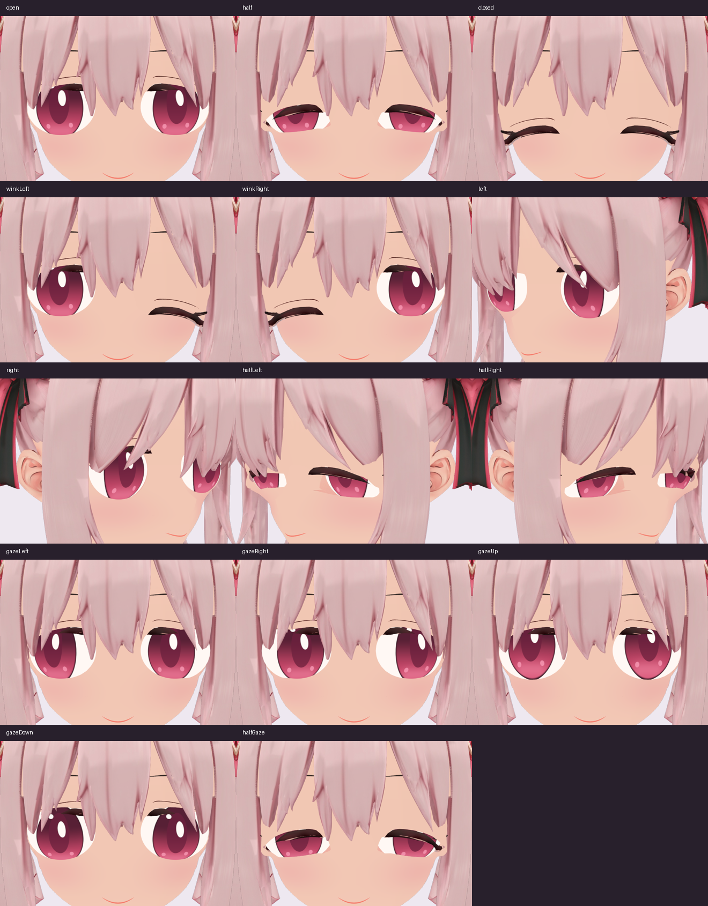
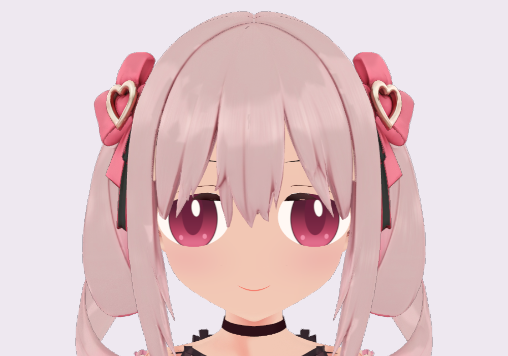

# 白い輪と虹彩ハイライトの修正

2026-09-30。ブラウザで表示する目元を修正しました。
元のまぶた・まつげ・眼球の形・骨・まばたき・視線を使い、眼球の描画だけを置き換えています。

## 原因と変更

`Eye_Left` と `Eye_Right` は、それぞれ760頂点の眼球メッシュです。
眼球用の焼き付け画像に、肌・まつげ・白い外周・崩れた白いハイライトが含まれていました。
まぶた側の肌画像には、この白い輪はありませんでした。
眼球画像の色補正だけでは、重複した外周や元のハイライトの形まで残ります。

`src/eye-surface.ts` で白目・ピンクの虹彩・瞳孔・反射を分けて描画します。
輪郭とハイライトには画面上の大きさに応じたアンチエイリアスを使います。
模様は眼球の元の座標に固定し、既存の眼球の骨で視線に追従します。
既存の深度判定で、まぶたと元のまつげが眼球を隠します。
目の画像へまつげや肌を重ねて描かないため、白い二重の輪や崩れた反射が出なくなりました。

この補正は `Avatar.load()` から全描画経路に適用します。
アプリでの表示・合成・出力・録画が同じアバター描画を使います。
VRM原本や配信用に分離したモデル画像、Blender原本は書き換えていません。
他のVRMビューアーには、このアプリ専用の補正は適用されません。

## 確認した条件

実ブラウザの実モデルを使い、以下の状態で描画画像を保存して確認しました。
カメラと照明は修正前後で同じです。
表情値と視線入力は制御した検査入力で、本人のWebカメラによる確認とは区別します。

- 開眼、まばたき25%・50%・80%・100%、左右のウィンク。
- 左右斜め向きの開眼・半眼・閉眼。
- 上下左右の視線と、半眼を組み合わせた視線。
- 目のアップと顔全体。白い外周とハイライトの崩れが再発しないこと。
- 正面と左右斜めの閉眼で、眼球を非表示にしても画像が変わらないこと。
  比較時だけ髪を固定し、3方向とも全画素差がゼロでした。
- 描画後のブラウザのエラーログに、シェーダーや実行時エラーがないこと。
- 自動テスト22件と型検査・配信ビルドの成功。
  新しい検査では、形状・骨の接続・独立したまぶたの材質が保持されることも確認します。
- 配信用モデルの130アクセサーと9画像のバイト列が原本と一致し、形状・骨・表情・材質の定義が保持されること。

眼球の非表示比較と原本のハッシュは、[描画検査記録](images/eye-design-20260930/render-analysis.json) に保存しています。
VRM原本のSHA-256は `5167e2f97b107dfdc8dda2b7e9add24a9392c506f39be0411a6c1a3e7fa5aab0` です。
本人のWebカメラ入力、他の端末・GPUでの見え方、録画の長時間動作は今回の検査範囲に含めていません。

